 
## 查看主页获取源码

### 一、作品包含

源码+数据库+设计文档万字+PPT+全套环境和工具资源+部署教程

### 二、项目技术

前端技术：Html、Css、Js、Vue、Element-ui

数据库：MySQL

后端技术：Java、Spring Boot、MyBatis

  

### 三、运行环境

开发工具：IDEA/eclipse

数据库：MySQL5.7

数据库管理工具：Navicat10以上版本

环境配置软件： JDK1.8+Maven3.6.3

前端Nodejs：14

### 四、项目介绍
项目编号：springbootA187

近年来，随着我国传统文化的复兴，国风彩妆逐渐成为时尚界的新宠。将传统元素与现代审美相结合，国风彩妆不仅为消费者带来独特的视觉体验，同时也体现了民族文化的自信与魅力。在此背景下，研究国风彩妆网站的设计与运营，有助于推动我国彩妆产业的发展，弘扬传统文化，提升我国彩妆品牌在国际市场的竞争力。本文将从国风彩妆的特点、市场需求、网站设计及运营策略等方面展开探讨，以期为我国彩妆产业提供有益的参考。

前台用户功能：浏览首页、商品信息、彩妆资讯、网站留言、购物车、个人中心。

后台管理员的功能：系统首页、个人中心、用户管理、商品分类管理、商品信息管理、系统管理和订单管理。

### 五、运行截图

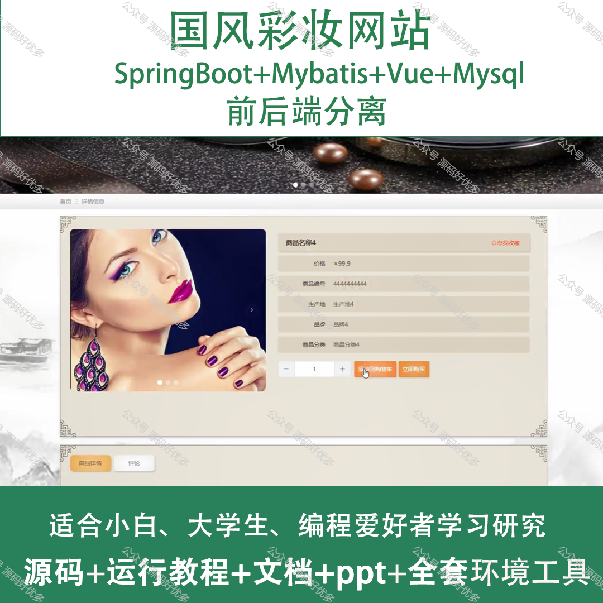
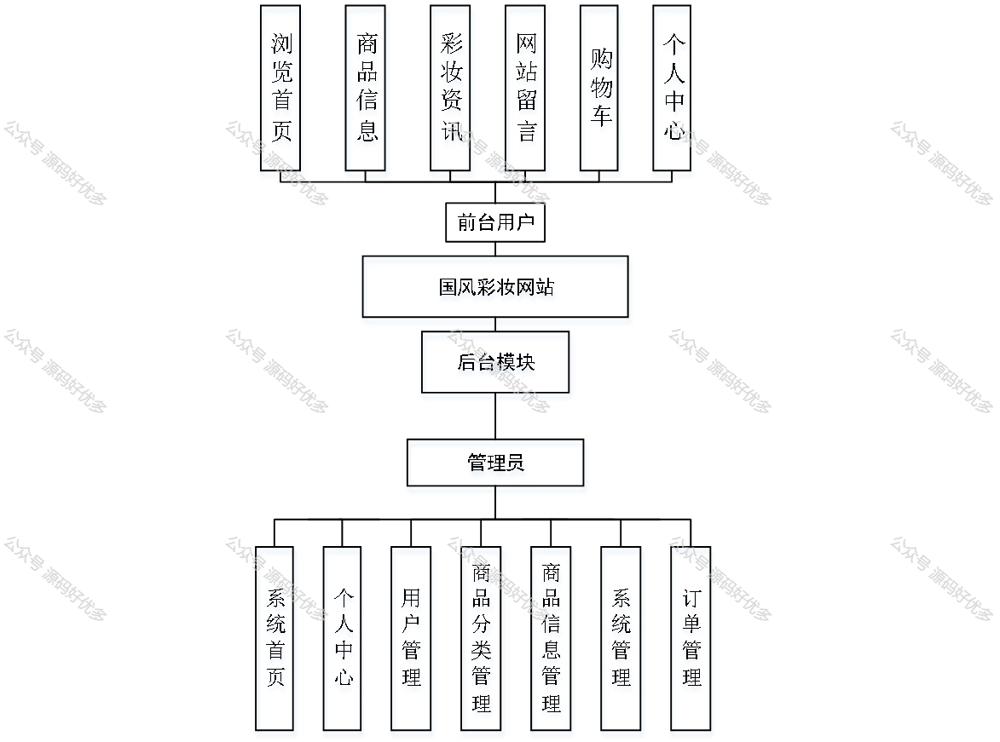
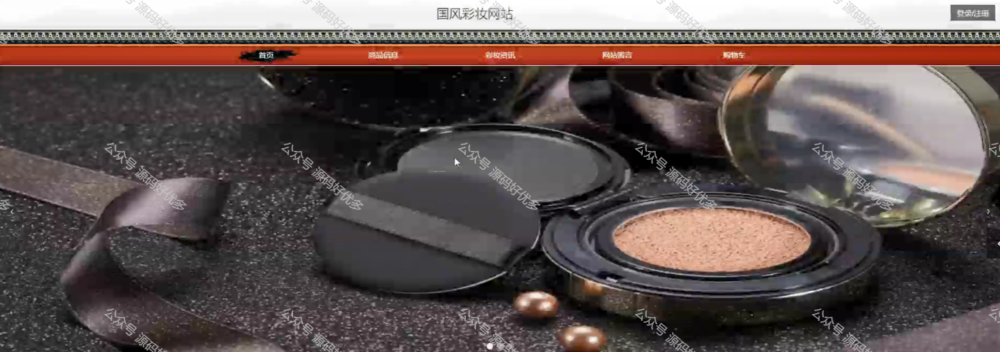
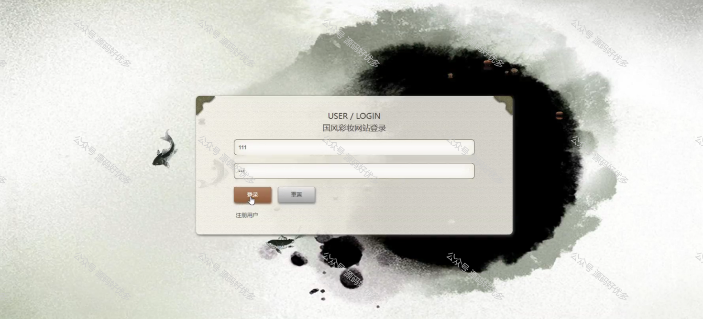
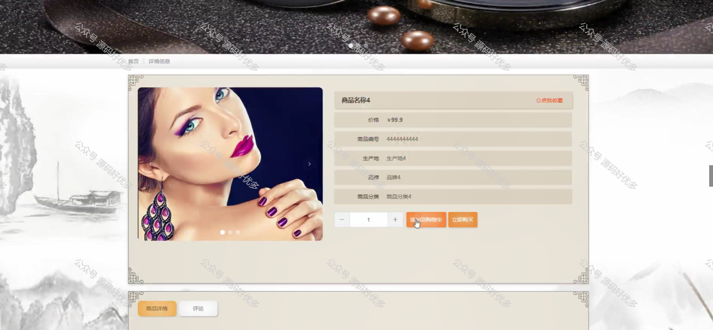
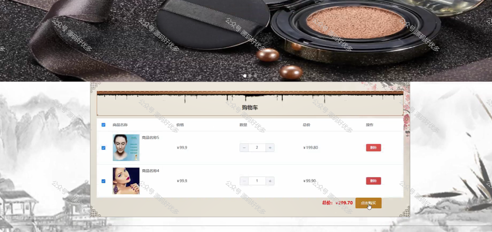
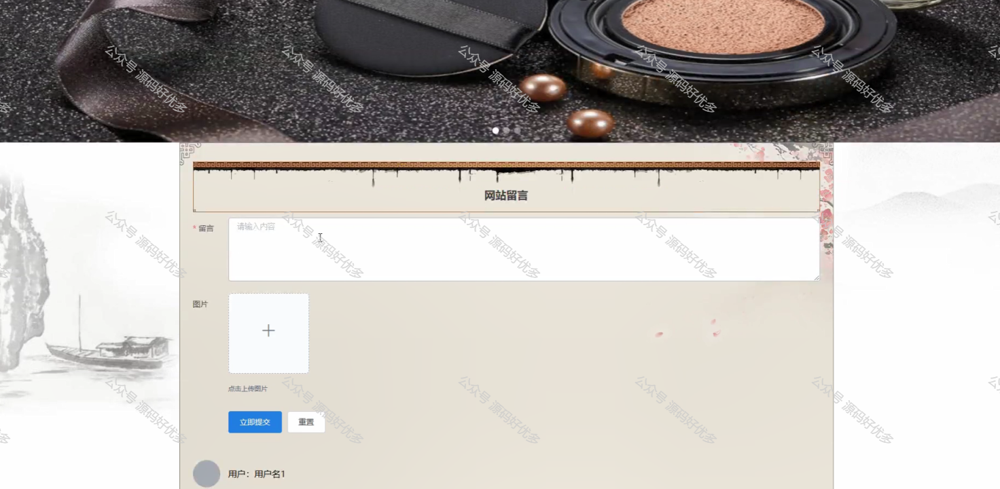
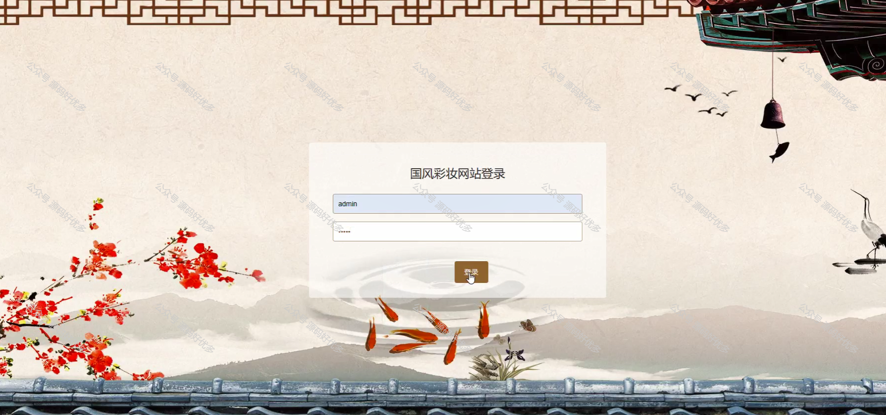
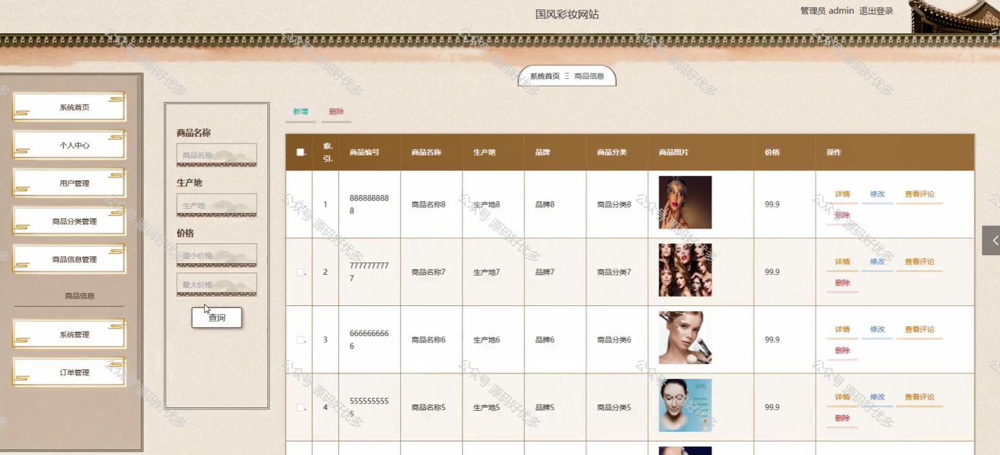
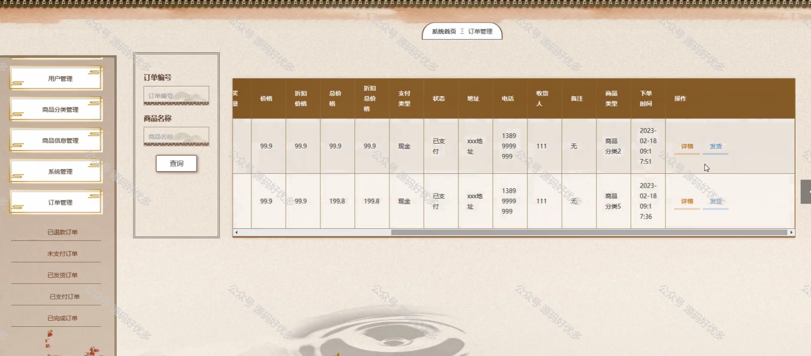
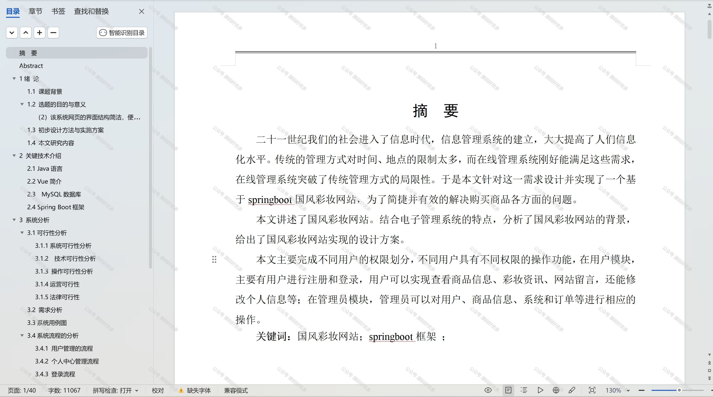

  
